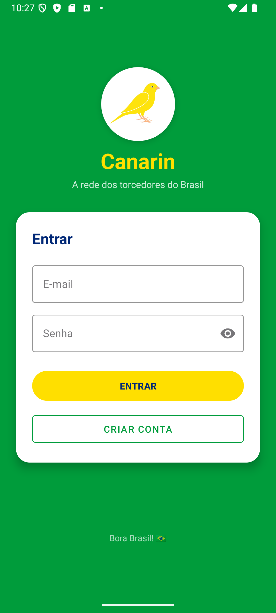
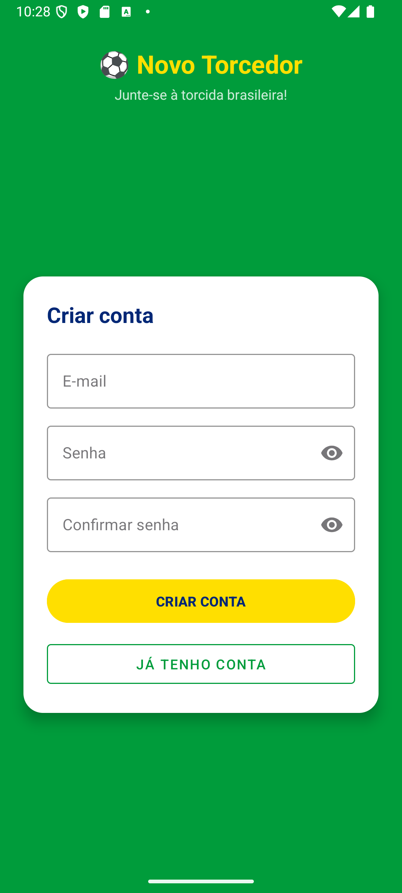
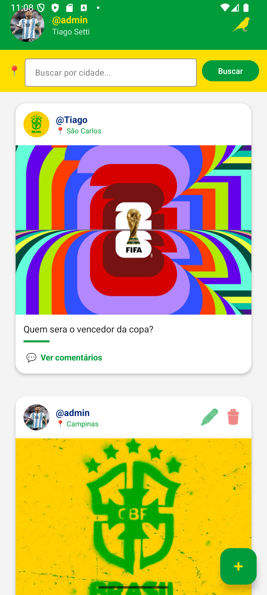
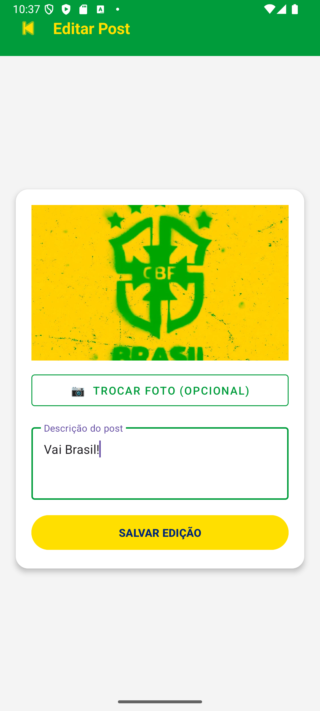
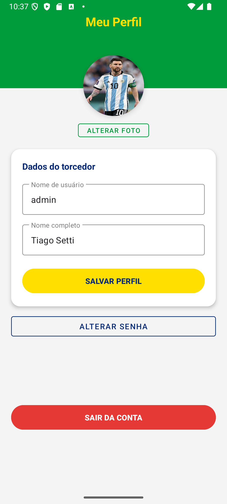
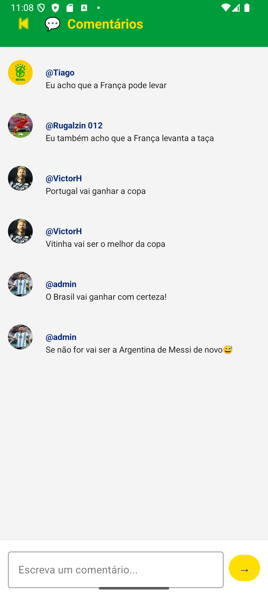

# ⚽ Canarin

> Rede social temática da Copa do Mundo — conectando torcedores brasileiros ao redor do mundo.

---

## 📱 Sobre o Projeto

O **Canarin** é uma rede social mobile desenvolvida em Android com Kotlin, criada como projeto acadêmico no IFSP - Campus Araraquara, no curso de Análise e Desenvolvimento de Sistemas. A proposta é uma plataforma onde torcedores do Brasil podem compartilhar momentos, fotos e experiências durante a Copa do Mundo, com identidade visual nas cores da Seleção Brasileira — verde, amarelo e azul.

**Status:** ✅ Concluído

---

## ✨ Funcionalidades

- **Autenticação** — cadastro e login com e-mail e senha via Firebase Authentication
- **Perfil de usuário** — foto, username e nome completo, com edição a qualquer momento
- **Alteração de senha** — reautenticação segura antes de trocar a senha
- **Feed de posts** — publicação de fotos com descrição, estilo Instagram
- **Geolocalização** — cada post registra a cidade de onde foi publicado usando Fused Location Provider e Geocoder
- **Busca por cidade** — filtragem do feed por localização
- **Comentários** — qualquer usuário pode comentar nos posts
- **Editar e excluir posts** — disponível apenas para o autor do post
- **Paginação por cursor** — carregamento do feed em páginas de 5 posts usando `Timestamp` como cursor
- **Logout** — encerramento de sessão com limpeza da pilha de activities

---

## 📸 Capturas de Tela

<table>
  <tr>
    <td align="center"><br/><sub>Login</sub></td>
    <td align="center"><br/><sub>Cadastro</sub></td>
    <td align="center"><br/><sub>Feed</sub></td>
  </tr>
  <tr>
    <td align="center"><br/><sub>Novo Post</sub></td>
    <td align="center"><br/><sub>Perfil</sub></td>
    <td align="center"><br/><sub>Comentários</sub></td>
  </tr>
</table>

---

## 🛠️ Tecnologias Utilizadas

| Tecnologia | Uso |
|---|---|
| Kotlin | Linguagem principal |
| Android SDK | Plataforma mobile |
| Firebase Authentication | Login e cadastro de usuários |
| Firebase Firestore | Banco de dados NoSQL em nuvem |
| Fused Location Provider | Obtenção de latitude e longitude |
| Geocoder | Conversão de coordenadas em endereço |
| RecyclerView | Listagem do feed com scroll infinito |
| ViewBinding | Acesso seguro às views |
| CardView | Layout dos cards do feed |
| Material Design 3 | Componentes de interface |

---

## 📁 Estrutura do Projeto

```
app/src/main/java/br/com/canarinho/redesocial/
├── auth/
│   └── UserAuth.kt          # Autenticação Firebase
├── adapter/
│   ├── PostAdapter.kt        # Adapter do feed
│   └── CommentAdapter.kt     # Adapter dos comentários
├── dao/
│   ├── UserDAO.kt            # Operações de usuário no Firestore
│   ├── PostDAO.kt            # Operações de post com paginação
│   └── CommentDAO.kt         # Operações de comentários
├── model/
│   ├── User.kt               # Modelo de usuário
│   ├── Post.kt               # Modelo de post
│   └── Comment.kt            # Modelo de comentário
├── ui/
│   ├── LoginActivity.kt
│   ├── SignUpActivity.kt
│   ├── HomeActivity.kt
│   ├── ProfileActivity.kt
│   ├── CreatePostActivity.kt
│   └── CommentsActivity.kt
└── util/
    ├── Base64Converter.kt    # Conversão imagem ↔ String
    └── LocalizacaoHelper.kt  # Geolocalização
```

---

## 🚀 Como Instalar e Executar

### Pré-requisitos

- Android Studio Hedgehog ou superior
- JDK 17+
- Conta no [Firebase Console](https://console.firebase.google.com)
- Dispositivo ou emulador com Android 8.0 (API 26) ou superior

### Passos

**1.** Clone o repositório:
```bash
git clone https://github.com/seu-usuario/canarinho-app.git
cd canarinho-app
```

**2.** Configure o Firebase:
- Crie um projeto no [Firebase Console](https://console.firebase.google.com)
- Adicione um app Android com o package name `com.example.canarinho.redesocial`
- Ative **Authentication → E-mail/senha**
- Ative o **Firestore Database**
- Baixe o `google-services.json` e coloque em `app/`

**3.** Abra o projeto no Android Studio e aguarde o Gradle sincronizar

**4.** Execute o app em um dispositivo ou emulador

### Dependências principais no `build.gradle`

```gradle
implementation 'com.google.firebase:firebase-auth-ktx'
implementation 'com.google.firebase:firebase-firestore-ktx'
implementation 'com.google.android.gms:play-services-location:21.3.0'
implementation 'androidx.recyclerview:recyclerview:1.3.2'
implementation 'androidx.cardview:cardview:1.0.0'
implementation 'com.google.android.material:material:1.12.0'
```

### Permissões necessárias no `AndroidManifest.xml`

```xml
<uses-permission android:name="android.permission.INTERNET" />
<uses-permission android:name="android.permission.ACCESS_FINE_LOCATION" />
<uses-permission android:name="android.permission.ACCESS_COARSE_LOCATION" />
```

---

## 📚 Aprendizado e Desafios

Durante o desenvolvimento do CanarinhApp, os principais aprendizados foram:

- **Arquitetura em camadas** — separação clara entre `ui`, `dao`, `model`, `adapter`, `auth` e `util`, tornando o código mais organizado e reutilizável
- **Paginação por cursor com Timestamp** — implementação do padrão `startAfter()` do Firestore para carregamento eficiente do feed sem duplicar dados
- **Geolocalização** — integração do Fused Location Provider com o Geocoder para converter coordenadas em nome de cidade, com tratamento de permissões em tempo de execução
- **ViewBinding** — substituição do `findViewById` por binding tipado, eliminando erros de referência em tempo de execução
- **Reautenticação Firebase** — entender que o Firebase exige reautenticação para operações sensíveis como troca de senha

O maior desafio foi controlar a paginação com scroll infinito sem duplicar posts — resolvido com um flag `carregando` no `PostDAO` que bloqueia chamadas simultâneas ao Firestore enquanto uma requisição já está em andamento.

---

## 📄 Licença

Este projeto foi desenvolvido para fins acadêmicos no **IFSP - Campus Araraquara**, no curso de **Análise e Desenvolvimento de Sistemas**. Uso livre para fins educacionais.

---

## 👨‍💻 Sobre o Autor

Desenvolvido por **Tiago Setti Mendes** como projeto prático da disciplina de Desenvolvimento Mobile.

---

## 📬 Contato

Tem alguma dúvida ou sugestão? Abra uma issue no repositório ou entre em contato!

---

<div align="center">
  <strong>Feito com 💚💛 e muito café ☕ — Bora Brasil! 🇧🇷</strong>
</div>
